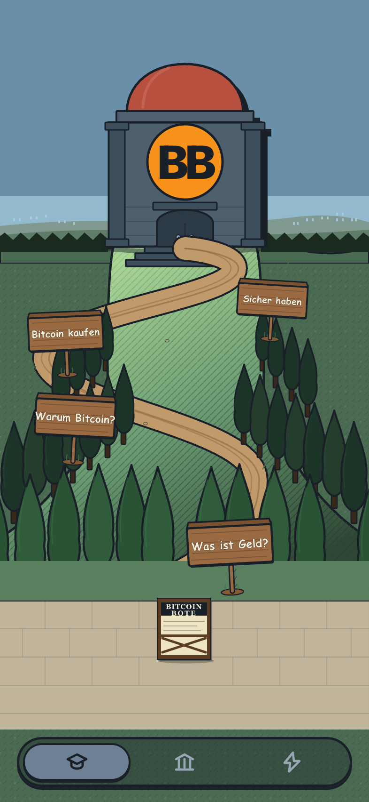
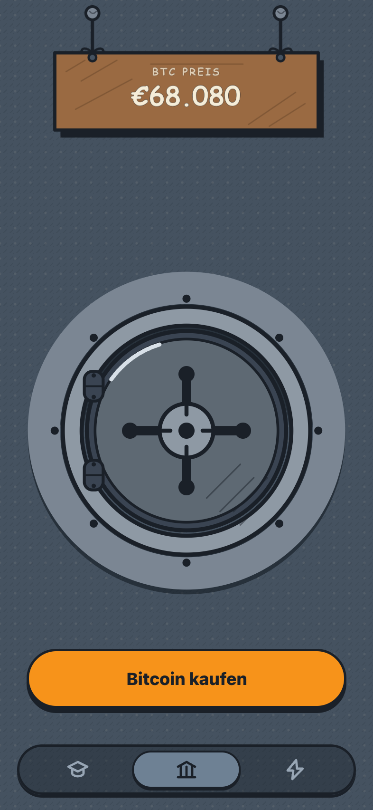
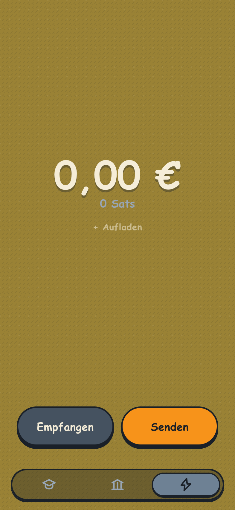

  

<h1 align="center">Geldspeicher</h1>

  A design study for a Bitcoin wallet — a vault that visibly fills as you 
  stack coins, instead of a price chart.

  <strong><a href="https://emilmeggle.github.io/Geldspeicher/">▶&nbsp; Live demo</a></strong>

<table>
  <tr>
    <td></td>
    <td></td>
    <td></td>
  </tr>
  <tr>
    <td align="center">Bildung — learn</td>
    <td align="center">Bank — hold</td>
    <td align="center">Bargeld — pay</td>
  </tr>
</table>

---

An interactive design concept by <a href="https://emilmeggle.me">Emil Meggle</a> — mocked balances, live BTC price (CoinGecko). Not a wallet and not custody; nothing here moves real funds.
