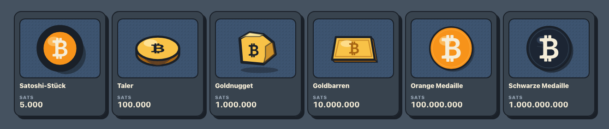

<h1 align="center">Geldspeicher</h1>

  A design study for a Bitcoin wallet — a vault that visibly fills as you 
  stack coins.

<h1 align="center">
  <strong><a href="https://emilmeggle.github.io/Geldspeicher/">▶&nbsp; Live demo</a></strong>
</h1>

